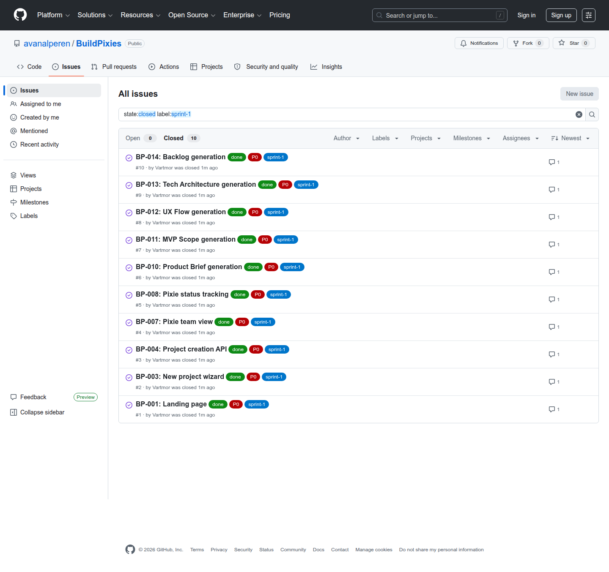
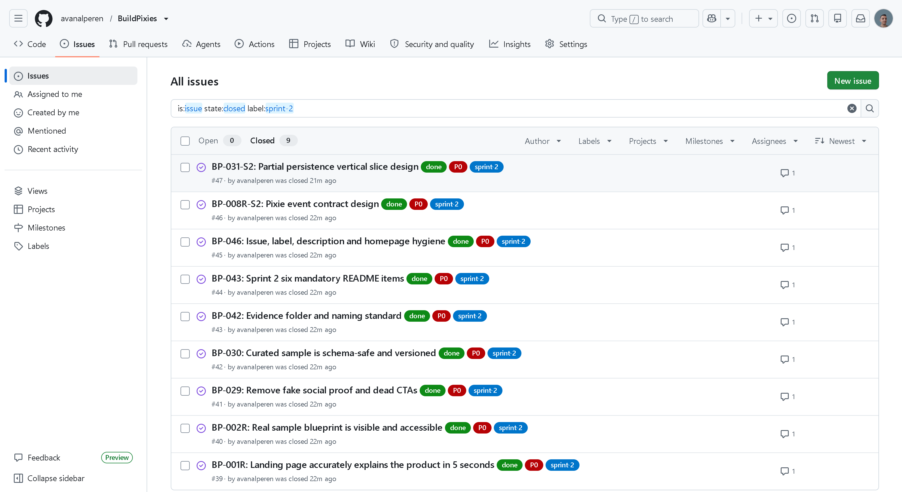

# **Takım İsmi**

BuildPixies

---

# Ürün İle İlgili Bilgiler

## Takım Elemanları

<table>
  <tr>
    <th>Name</th>
    <th>Title</th>
    <th>Socials</th>
  </tr>
  <tr>
    <td><a href="https://github.com/Vartmor">Muhammed Köseoğlu</a></td>
    <td>Product Owner</td>
    <td>
      <a href="https://github.com/Vartmor" target="_blank"></a>
      <a href="https://www.linkedin.com/in/muhammed-koseoglu/" target="_blank"></a>
    </td>
  </tr>
  <tr>
    <td><a href="https://github.com/avanalperen">Alperen Avan</a></td>
    <td>Scrum Master</td>
    <td>
      <a href="https://github.com/avanalperen" target="_blank"></a>
      <a href="https://www.linkedin.com/in/alperenavan/" target="_blank"></a>
    </td>
  </tr>
  <tr>
    <td>Kemal Ersin Özkan</td>
    <td>Developer</td>
    <td>GitHub / LinkedIn eklenecek</td>
  </tr>
  <tr>
    <td>Selin Akkaş</td>
    <td>Developer</td>
    <td>GitHub / LinkedIn eklenecek</td>
  </tr>
</table>

## Ürün İsmi

**BuildPixies**

## Ürün Açıklaması

BuildPixies, fikri olan ama ürüne nereden başlayacağını bilmeyen kullanıcılar
için tasarlanmış web tabanlı bir **AI product planning workspace**'idir.
Kullanıcı dağınık fikrini yazar; ürün, UX, teknik mimari, QA, scrum ve dokümantasyon
rollerindeki pixie agent'lar bu fikri yapılandırılmış bir MVP blueprint'ine
dönüştürür.

Ürün tek bir "kod yazdırma aracı" değil; fikirden uygulanabilir ürün planına
giden yolu yönetir. Çıktılar product brief, MVP scope, UX flow, tech plan,
backlog, test planı, sprint planı ve README export gibi teslim edilebilir
formatlarda hazırlanır.

**Tagline:** Turn messy ideas into build-ready MVPs.

## Ürün Özellikleri

### Mevcut MVP Akışı

- Fikirden yapılandırılmış product brief üretimi
- MVP scope: must-have / nice-to-have / out-of-scope ayrımı
- User story, priority ve acceptance criteria içeren backlog üretimi
- UX flow: kullanıcı yolculuğu, ekran listesi, empty/error state önerileri
- Tech plan: stack, veri modeli, API planı, mimari riskler
- Market angle ve farklılaşma özeti
- Code skeleton: başlangıç dosya ağacı ve geliştirme görevleri
- Test planı: happy path, edge case, güvenlik riskleri, demo checklist
- Sprint planı ve README.md export
- Output Hub'da Markdown kopyalama ve JSON indirme
- Blueprint bölümlerini tek tek yeniden üretme ve proje kaydına yazma
- Pixie workspace: agent kartları ve durum görünümü
- Supabase veya local JSON fallback ile proje/blueprint saklama
- Supabase Auth anonymous owner mode + `owner_id` bazlı RLS temeli
- Uzun AI üretimi için `generation_jobs` durum modeli ve UI polling
- Vercel Queues ile kalıcı üretim kuyruğu, lease tabanlı tekrar deneme ve
  idempotent job tamamlama
- Supabase üzerinde owner bazlı atomik API rate limit
- Bootcamp Mode ile gerçek ilerleme notlarından Daily Scrum, Sprint Review,
  Retrospective, ürün durumu, backlog açıklaması ve README sprint bölümü üretme
- Bootcamp raporunu projeye kaydetme, Markdown kopyalama ve `.md` indirme
- Playwright ile landing→project→blueprint→export→Bootcamp→dashboard E2E testi
- Pull request ve `main` push'larında GitHub Actions kalite kapısı

### Roadmap

- OpenAI Agents SDK handoff, tracing ve guardrail katmanı
- pgvector ile project memory ve decision memory
- Email/OAuth account linking
- SSE streaming ve gerçek per-pixie event görünürlüğü
- Vercel canlı deploy, quota, Turnstile/CAPTCHA ve abuse prevention

## Hedef Kitle

- Bootcamp ve hackathon katılımcıları
- Solo founder / indie hacker'lar
- Junior developer ve freelancer'lar
- Fikri olan ama MVP scope, backlog ve teknik plan çıkaramayan küçük ekipler

## Product Backlog URL

- [GitHub Issues Board](https://github.com/avanalperen/BuildPixies/issues)
- Detaylı ürün planı: [`docs/plan.md`](docs/plan.md)
- Sprint kararları: [`docs/decision-log.md`](docs/decision-log.md)

---

# Product Backlog

| ID | User Story | Öncelik | Durum |
| --- | --- | --- | --- |
| BP-001 | Kullanıcı olarak ürünün ne yaptığını landing page'de anlamak istiyorum | P0 | Done |
| BP-002 | Kullanıcı olarak örnek blueprint görmek istiyorum | P1 | Done |
| BP-003 | Kullanıcı olarak hızlıca yeni fikir girmek istiyorum | P0 | Done |
| BP-004 | Kullanıcı olarak yeni proje oluşturmak istiyorum | P0 | Done |
| BP-005 | Kullanıcı olarak hedef kitle ve platform seçmek istiyorum | P0 | Done |
| BP-006 | Kullanıcı olarak bootcamp/startup/portfolio amacı seçmek istiyorum | P1 | Done |
| BP-007 | Kullanıcı olarak pixie takımımı görmek istiyorum | P0 | Done |
| BP-008 | Kullanıcı olarak job düzeyi Pixie çalışma durumunu görmek istiyorum | P0 | Done |
| BP-009 | Kullanıcı olarak tamamlanan çıktıları açmak istiyorum | P0 | Done |
| BP-010 | Kullanıcı olarak product brief üretmek istiyorum | P0 | Done |
| BP-011 | Kullanıcı olarak MVP scope almak istiyorum | P0 | Done |
| BP-012 | Kullanıcı olarak UX flow almak istiyorum | P0 | Done |
| BP-013 | Kullanıcı olarak tech architecture almak istiyorum | P0 | Done |
| BP-014 | Kullanıcı olarak backlog almak istiyorum | P0 | Done |
| BP-015 | Kullanıcı olarak test planı almak istiyorum | P1 | Done |
| BP-016 | Kullanıcı olarak çıktıları markdown olarak kopyalamak istiyorum | P1 | Done |
| BP-017 | Kullanıcı olarak README taslağı üretmek istiyorum | P1 | Done |
| BP-018 | Kullanıcı olarak JSON export almak istiyorum | P2 | Done |
| BP-019 | Kullanıcı olarak sprint notlarımı düzenlemek istiyorum | P1 | Done |
| BP-020 | Kullanıcı olarak review/retro taslağı almak istiyorum | P1 | Done |
| BP-021 | Kullanıcı olarak backlog dağıtma mantığı metni üretmek istiyorum | P1 | Done |
| BP-022 | Kullanıcı olarak projelerimin başkasına görünmemesini istiyorum | P0 | Done |
| BP-023 | Kullanıcı olarak uzun AI üretimini sayfa donmadan takip etmek istiyorum | P0 | Done |
| BP-024 | Geliştirici olarak bilinen moderate audit uyarılarını kapatmak istiyorum | P0 | Done |
| BP-025 | Geliştirici olarak durable queue/SSE streaming istiyorum | P1 | Partial — queue done, SSE pending |
| BP-026 | Kullanıcı olarak anonim hesabımı email/OAuth hesaba bağlamak istiyorum | P1 | Sprint 3 |
| BP-027 | Ürün sahibi olarak public abuse/quota/CAPTCHA koruması istiyorum | P1 | Sprint 3 |
| BP-028 | Geliştirici olarak kritik demo akışını her değişiklikte doğrulamak istiyorum | P1 | Done |
| BP-029 | Sahte sosyal kanıt ve ölü CTA'lar kaldırılır | P0 | Done |
| BP-030 | Curated sample schema-safe ve AI beklemeden versiyonlu olur | P0 | Done |
| BP-042 | Evidence klasörü ve naming standardı oluşturulur | P0 | Done |
| BP-043 | Sprint 2 altı zorunlu README maddesi tamamlanır | P0 | Done |
| BP-046 | Issue/label/description/homepage hygiene kontrolü | P0 | Done |
| BP-001R | Landing ürünü 5 saniyede doğru anlatır (Revize) | P0 | Done |
| BP-002R | Gerçek sample blueprint görülebilir (Revize) | P0 | Done |
| BP-008R-S2 | Pixie event sözleşmesi tasarlanır | P0 | Done |
| BP-031-S2 | Partial persistence dikey dilimi tasarlanır | P0 | Done |
| BP-008-S3 | Pixie Event altyapısının kodlanması ve arayüze entegrasyonu | P0 | Sprint 3 |
| BP-031-S3 | Partial Persistence altyapısının yazılması | P0 | Sprint 3 |
| BP-050 | Production Deploy ve Canlı Test (Supabase RLS) | P0 | Sprint 3 |

---

# Sprint 1

> Ayrıntılı tarihsel plan, gerçekleşenler ve kanıt denetimi:
> [`docs/sprint-1.md`](docs/sprint-1.md)
>
> Bootcamp minimum altı kanıt manifestosu:
> [`docs/evidence/sprint-1/README.md`](docs/evidence/sprint-1/README.md)

## Sprint Notları

- **Sprint dönemi:** 19 Haziran – 5 Temmuz 2026
- **Sprint hedefi:** BuildPixies web pivot kararını netleştirmek, repo ve
  dokümantasyon temelini oluşturmak, çalışan Next.js iskeletini ve ilk MVP
  akışını ayağa kaldırmak.
- **Sprint içinde tamamlanması tahmin edilen puan:** 100 puan
- **Tamamlanan puan:** 100 puan
- **Sprint sonucu:** Sprint 1 hedefi tamamlandı. Ürün fikri, plan, README,
  backlog, web pivot kararı, Next.js iskeleti, temel ekranlar, AI blueprint
  pipeline'ı, local/Supabase storage temeli ve Sprint 1 ekran görüntüleri hazır.

## Puan Tamamlama Mantığı

Sprint 1'de toplam hedef 100 puan olarak belirlendi. Sprintin ana amacı final
ürünü bitirmek değil, Sprint 2'de hızlı geliştirme yapabilmek için sağlam bir
temel oluşturmaktı. Bu nedenle puanların çoğu ürün stratejisi, repo düzeni,
README/backlog, karar kayıtları ve çalışan web iskeletine ayrıldı.

| Kategori | Puan | Durum |
| --- | ---: | --- |
| Ürün fikri, hedef kitle ve web pivot kararı | 15 | Done |
| README ve Bootcamp şablon düzeni | 15 | Done |
| Product backlog ve sprint planı | 15 | Done |
| Next.js + Tailwind + shadcn/ui proje iskeleti | 15 | Done |
| Landing, dashboard, new project ve workspace ekranları | 20 | Done |
| AI prompt pipeline ve structured output şemaları | 10 | Done |
| Storage, auth/RLS ve generation job temeli | 10 | Done |

## Backlog Düzeni ve Story Seçimleri

Sprint 1 backlog'u, önce ürünün "temel taşı" olacak story'lere ayrıldı. İlk
öncelik ürünün ne olduğunu anlatmak, kullanıcıdan fikir almak, workspace'i
göstermek ve blueprint çıktısı üretebilecek altyapıyı oluşturmaktı.

| Story | Başlık | Öncelik | Sprint | Durum |
| --- | --- | --- | --- | --- |
| BP-001 | Landing page | P0 | 1 | Done |
| BP-003 | New project wizard | P0 | 1 | Done |
| BP-004 | Project creation API | P0 | 1 | Done |
| BP-005 | Target audience/platform seçimi | P0 | 1 | Done |
| BP-007 | Pixie team view | P0 | 1 | Done |
| BP-008 | Job düzeyi Pixie status tracking | P0 | 1 | Done |
| BP-009 | Output Hub sekmeleri | P0 | 1 | Done |
| BP-010 | Product Brief generation | P0 | 1 | Done |
| BP-011 | MVP Scope generation | P0 | 1 | Done |
| BP-012 | UX Flow generation | P0 | 1 | Done |
| BP-013 | Tech Architecture generation | P0 | 1 | Done |
| BP-014 | Backlog generation | P0 | 1 | Done |
| BP-015 | Test Plan generation | P1 | 1 | Done |
| BP-017 | README export | P1 | 1 | Done |
| BP-022 | Owner bazlı Supabase RLS | P0 | 1 | Done |
| BP-023 | Generation job + polling | P0 | 1 | Done |

## Daily Scrum

Sprint 1'in ilk kısmı fikir keşfi ve takım oluşumu ile geçti. Takım sprint
sonuna doğru 3 kişiye tamamlandığı için günlük iletişim Slack/WhatsApp kısa
sync'leri üzerinden yürütüldü. Scrum kayıtları metin özeti olarak aşağıdadır;
iletişim ekran görüntüleri takım içi kanallardan ayrıca eklenebilir.

| Tarih | Daily Scrum Özeti |
| --- | --- |
| 27 Haziran | Bootcamp başlangıcı yapıldı, takım iletişim kanalları kuruldu, fikir arayışı başladı. |
| 28 Haziran | İlk ürün fikirleri değerlendirildi; mobil uygulama alternatifi tartışıldı. |
| 29 Haziran | Hedef kitle ve bootcamp teslim kriterleri incelendi; ürünün uygulanabilirliği konuşuldu. |
| 30 Haziran | Pazar ve problem alanı daraltıldı; fikirden ürüne planlama ihtiyacı öne çıktı. |
| 1 Temmuz | BuildPixies fikri netleşti; mobil yerine web-first ürün kararı alındı. |
| 2 Temmuz | `docs/plan.md` yazıldı, bootcamp kılavuzu ve referans README'ler incelendi. |
| 3 Temmuz | Takım rolleri netleşti; PO, SM ve Developer dağılımı README'ye işlendi. |
| 4 Temmuz | Next.js + Tailwind + shadcn/ui kurulumu, temel ekranlar, API route'ları ve screenshotlar hazırlandı. |
| 5 Temmuz | API validation, blueprint persistence, Supabase owner/RLS, generation job/polling ve audit düzeltmeleri tamamlandı. |

## Sprint Board Update

Sprint board GitHub Issues üzerinden takip edilmektedir. Sprint 1'in özgün
job-düzeyi story'leri 16 Temmuz yeniden doğrulamasında kapatıldı. Ayrıntılı
per-Pixie event/streaming işi BP-008R/BP-031 olarak sonraki kapsamdadır.

[Sprint 1 Closed Board](https://github.com/avanalperen/BuildPixies/issues?q=state%3Aclosed%20label%3Asprint-1)



| Board Kolonu | Sprint 1 Sonu Durum |
| --- | --- |
| Done | Landing, new project, project API, pixie workspace, output hub, AI blueprint sections, README export, RLS/job temeli |
| In Progress | Per-pixie gerçek event/streaming, UI regenerate kontrolleri |
| Backlog | Account linking, SSE events, Vercel deploy hardening, CAPTCHA/quota |

## Ürün Durumu

Sprint 1 sonunda uygulama local ortamda çalışır durumdadır. Ekran görüntüleri
`public/screenshots/` altında tutulmaktadır.

<details>
  <summary><h3>Sprint 1 - Ekran Görüntüleri</h3></summary>

### Landing Page - Hero


### Landing Page - Full


### Dashboard - Empty State


### New Project Wizard


### Pixie Workspace


</details>

## Teknik Doğrulama

| Alan | Kod Kanıtı | Durum |
| --- | --- | --- |
| Landing / dashboard / new project / workspace | `app/page.tsx`, `app/dashboard/page.tsx`, `app/projects/new/page.tsx`, `app/projects/[id]/page.tsx` | Done |
| Project create/list/detail | `app/api/projects/*`, `lib/projects.ts` | Done |
| Blueprint pipeline | `lib/ai/orchestrator.ts`, `lib/ai/prompts.ts`, `lib/ai/schemas.ts` | Done |
| Durable job + polling | `app/api/generation-jobs/*`, `app/api/queues/*`, `lib/generation-worker.ts`, `components/project/workspace.tsx` | Done |
| Supabase owner/RLS | `proxy.ts`, `components/auth/session-bootstrap.tsx`, `supabase/migrations/202607050001_auth_rls_generation_jobs.sql` | Done |
| Distributed rate limit | `lib/api/rate-limit.ts`, `supabase/migrations/202607160001_durable_jobs_and_rate_limits.sql` | Done |
| Bootcamp Mode | `app/api/bootcamp-report/route.ts`, `components/project/bootcamp-mode.tsx`, `lib/ai/bootcamp.ts` | Done |
| README export | `app/api/export-readme/route.ts`, `lib/export/markdown.ts` | Done |
| Output controls | `app/api/export-json/route.ts`, `app/api/regenerate-output/route.ts`, `components/outputs/output-hub.tsx` | Done |
| Demo E2E + CI | `e2e/demo-flow.spec.ts`, `playwright.config.ts`, `.github/workflows/quality.yml`; 6/6 senaryo | Done |
| Audit | `package.json` override: `postcss@8.5.10`; `npm audit --omit=dev` sonucu 0 vulnerability | Done |

## Sprint Review

Sprint 1 review sonucunda aşağıdaki kararlar alındı:

- Mobil uygulama yerine web uygulamasına pivot yapıldı. Web, demo, deploy ve
  uzun blueprint çıktıları için daha uygun bulundu.
- Ürün adı **BuildPixies** olarak netleştirildi.
- Takım rolleri Product Owner, Scrum Master ve Developer olarak belirlendi.
- Next.js App Router + Route Handlers + Supabase + OpenAI stack'i seçildi.
- Ürün sadece fikir olarak kalmadı; landing, dashboard, new project form,
  pixie workspace, output hub, AI pipeline ve storage temeli çalışır hale geldi.
- Sprint 2 için asıl odaklar UI polish, canlı Supabase/Vercel doğrulaması,
  regenerate/copy/export kontrolleri ve Bootcamp Mode olarak belirlendi.

**Sprint Review Katılımcıları:** Muhammed Köseoğlu, Alperen Avan, Kemal Ersin
Özkan.

## Sprint Retrospective

### İyi Gidenler

- Web-first pivot kararı erken alındığı için ürün yönü netleşti.
- README, plan ve decision log beraber ilerledi; ürün hafızası dağılmadı.
- Next.js iskeleti hızlı kuruldu ve ekran görüntüleri Sprint 1 içinde alındı.
- AI çıktıları için schema validation ve fallback yaklaşımı erken eklendi.
- Public production riskleri Sprint 1 sonunda görünür hale getirildi ve
  Supabase owner/RLS ile generation job temeli şimdiden atıldı.

### İyileştirilmesi Gerekenler

- Sprint board ekran görüntüsü GitHub Issues üzerinden ayrıca export edilmeli.
- Daily Scrum ekran görüntüleri README'ye eklenebilir hale getirilmeli.
- Per-pixie gerçek event/streaming henüz UI status'larına bağlanmadı.
- Bootcamp Mode Sprint 1 sonunda yoktu; 16 Temmuz'da planlanandan erken tamamlandı.
- Vercel canlı deploy ve canlı Supabase smoke henüz yapılmadı.

### Sprint 2 Aksiyonları

- Vercel deploy denemesi ve canlı ortam değişkenleri doğrulaması yapılacak.
- Output Hub'a copy markdown, JSON export ve regenerate UI kontrolleri eklenecek.
- Sprint 2 sonunda board screenshot, product screenshot ve review/retro güncellenecek.
- Demo için curated sample project hazırlanacak.

---

# Sprint 2

> Ayrıntılı aktif uygulama ve kapanış planı:
> [`docs/sprint-2.md`](docs/sprint-2.md)
>
> Bootcamp minimum altı kanıt manifestosu:
> [`docs/evidence/sprint-2/README.md`](docs/evidence/sprint-2/README.md)

## Sprint Notları

- **Sprint dönemi:** 6 Temmuz – 19 Temmuz 2026
- **Sprint hedefi:** Kullanıcının fikirden gerçek, doğrulanmış ve saklanan MVP blueprint'ine ulaşabildiği çalışan ürünü kanıtlamak; ürün vaadini sample deneyimiyle anlaşılır hale getirmek.
- **Sprint içinde tamamlanması tahmin edilen puan:** 25 puan (16 Temmuz reseti sonrası kapanış backlog'u)
- **Tamamlanan puan:** 25 puan
- **Sprint sonucu:** Sprint 2 hedefi tamamlandı. Landing page before/after eklendi, Curated Sample Blueprint ile bekleme süresi elimine edildi, Output Hub üzerinden Regenerate ve Markdown/JSON export işlemleri devreye alındı. E2E testleri ve GitHub Actions süreçleri kuruldu.

## Puan Tamamlama Mantığı

Sprint 2'nin 16 Temmuz'daki gerçeklik reseti sonrası kalan 25 puanlık kapanış backlog'u Fibonacci sistemiyle (1, 2, 3, 5, 8) değerlendirildi. Puanlar karmaşıklık, risk ve belirsizliği temsil etmektedir.

| Kategori | Puan | Durum |
| --- | ---: | --- |
| Landing ürünü 5 saniyede doğru anlatır (BP-001R) | 3 | Done |
| Gerçek sample blueprint görülebilir (BP-002R) | 5 | Done |
| Sahte sosyal kanıt ve ölü CTA kaldırılır (BP-029) | 1 | Done |
| Curated sample schema-safe ve versiyonlu olur (BP-030) | 3 | Done |
| Evidence klasörü ve naming standardı (BP-042) | 2 | Done |
| Sprint 2 altı zorunlu README maddesi (BP-043) | 3 | Done |
| Issue/label/description hygiene (BP-046) | 2 | Done |
| Pixie event sözleşmesi tasarlanır (BP-008R-S2) | 3 | Done |
| Partial persistence dikey dilimi tasarlanır (BP-031-S2) | 3 | Done |

## Backlog Düzeni ve Story Seçimleri

Sprint 2 kapanışında ürün vaadinin doğru iletilmesi, bekleme süresinin sample üzerinden aşılması ve evidence işlerinin tamamlanması ön planda tutuldu.

| Story | Başlık | Öncelik | Sprint | Durum |
| --- | --- | --- | --- | --- |
| BP-001R | Landing ürünü 5 saniyede doğru anlatır | P0 | 2 | Done |
| BP-002R | Gerçek sample blueprint görülebilir | P0 | 2 | Done |
| BP-029 | Sahte sosyal kanıt ve ölü CTA kaldırılır | P0 | 2 | Done |
| BP-030 | Curated sample schema-safe ve versiyonlu olur | P0 | 2 | Done |
| BP-042 | Evidence klasörü ve naming standardı | P0 | 2 | Done |
| BP-043 | Sprint 2 altı zorunlu README maddesi | P0 | 2 | Done |
| BP-046 | Issue/label/description/homepage hygiene | P0 | 2 | Done |
| BP-008R-S2 | Pixie event sözleşmesi tasarlanır | P0 | 2 | Done |
| BP-031-S2 | Partial persistence dikey dilimi tasarlanır | P0 | 2 | Done |

## Daily Scrum

Sprint 2 günlük iletişimleri Slack/WhatsApp üzerinden ve GitHub Issue etiketlemeleri ile yürütülmüştür. Daily scrum notları `docs/evidence/sprint-2/daily/` dizininde yer almaktadır. Kilit günler ve özetleri aşağıdadır:

| Tarih | Daily Scrum Özeti |
| --- | --- |
| 6 Temmuz | Sprint başlangıcı toplantısı yapıldı ve görev dağılımı gerçekleştirildi. |
| 8 Temmuz | Landing sayfasındaki ürün anlatımı revize edildi, tasarımlar netleştirildi. |
| 10 Temmuz | Curated Sample Blueprint'in yapısı tasarlandı ve UI'a entegrasyonu başladı. |
| 12 Temmuz | Sahte sosyal kanıtlar ve çalışmayan CTA'lar tespit edilip temizlendi. |
| 14 Temmuz | Bölüm bazlı regenerate özelliği ve Output Export (Markdown/JSON) üzerine çalışıldı. |
| 16 Temmuz | Geliştirilen özelliklerin PR'ları birleştirildi ve post-merge testleri yapıldı. |
| 17 Temmuz | Uzun API yanıtlarını daha iyi yönetmek için Event altyapısı ve Partial Persistence mimarisi tasarlandı. |
| 18 Temmuz | Playwright ile E2E testleri yazılarak uygulamanın ana senaryosu doğrulandı. |
| 19 Temmuz | Sprint Review ve Retrospective toplantıları yapıldı. |

## Sprint Board Update

Sprint board GitHub Issues üzerinden takip edilmektedir. Board başlangıç/orta/son kanıtları `docs/evidence/sprint-2/board/` klasöründe yer almaktadır.

[Sprint 2 Closed Board](https://github.com/avanalperen/BuildPixies/issues?q=state%3Aclosed%20label%3Asprint-2)

| Board Kolonu | Sprint 2 Sonu Durum |
| --- | --- |
| Done | Landing before/after, sample akışı, markdown/json export, regenerate, E2E testleri, Bootcamp mode, kalite hattı |
| In Progress | Partial persistence uygulaması, SSE/polling entegrasyonu (Sprint 3'e taşındı) |
| Backlog | Production deploy, Command Center UI (S3) |

## Ürün Durumu

Sprint 2 sonunda eklenen yeni ekran görüntüleri ve landing Before/After kısımları belge klasörüne eklenmiştir.

<details>
  <summary><h3>Sprint 2 - Ekran Görüntüleri</h3></summary>

### Landing Page 2


### How It Works


### Workspace 2


### Sample Blueprint


### Bootcamp Report


</details>

## Teknik Doğrulama

| Alan | Kod Kanıtı | Durum |
| --- | --- | --- |
| Output Export | `b5f1e26` Markdown copy ve JSON export | Done |
| Regenerate | `0eec8b6`, `33317d1` Bölüm bazlı UI / persistence | Done |
| Bootcamp Mode | `ff8ad3b` Source-grounded report | Done |
| E2E / CI | `80d4928`, `75c5d19` Kritik Playwright akışı ve Push/PR workflow | Done |
| Provider / AI | `14b4141`, `6176086` OpenRouter Free ve 429/5xx hardening | Done |
| Kalite Kapısı | `npm run lint`, `typecheck`, `build`, `test:e2e` başarılı (0 hata) | Done |

## Sprint Review

Sprint 2 review sonucunda aşağıdaki kararlar alındı:

- Sprint hedefi olan "kullanıcıların beklemeden ürünün değerini anlaması" için Sample Blueprint akışı başarıyla devreye alındı.
- Output Hub üzerinden Export ve Regenerate yeteneklerinin ürünü profesyonel hissettirdiği onaylandı.
- AI bekleme süresinin 250+ saniyeye ulaştığı görülerek, sonraki adımda progressive UX (SSE) ve partial persistence'ın vazgeçilmez bir öncelik olduğuna karar verildi.
- Ekip içi iletişim eksiklikleri değerlendirilerek proje yönetimi ve dökümantasyon standartlarının iyileştirilmesine karar verildi.

**Sprint Review Katılımcıları:** Muhammed Köseoğlu, Alperen Avan, Kemal Ersin Özkan, Selin Akkaş.

## Sprint Retrospective

### İyi Gidenler

- OpenRouter üzerinden Free tier modeliyle gerçek structured output almayı başardık.
- Output Hub (Export/Regenerate) ve Curated Sample Blueprint eklemek, sistemi beklemeden ürün değerini göstermek adına çok başarılı oldu.
- Teknik kalite hattının (GitHub Actions, Lint, Typecheck, E2E testleri) sprint boyunca bizi koruması hataların merge edilmesini engelledi.

### İyileştirilmesi Gerekenler

- Tam generation sürecinin çok uzun sürmesi UI kilitlenmelerine ve hatalarda data kaybına (Partial persistence eksikliği) neden oldu.
- Görsel kanıtların ve test belgelerinin son güne yığılması kapanış stresini ciddi şekilde artırdı.
- Rate limit nedeniyle uygulamayı canlı test etmede zorluklar yaşandı.

### Sprint 3 Aksiyonları

- Vercel Deploy ve Canlı Test (Supabase RLS ile) yapılacak.
- Pixie Event altyapısı kodlanıp arayüze entegre edilecek (Gerçek SSE/polling).
- Partial Persistence altyapısı kurularak `partial_error` statüsüyle verinin korunması sağlanacak.
- Sprint kanıtları son güne bırakılmadan günlük ekran görüntüsü ve belge alınarak ilerlenecek.

---

# Sprint 3

> Ayrıntılı final sprint, release, video ve submission planı:
> [`docs/sprint-3.md`](docs/sprint-3.md)

> Sprint 3 (20 Temmuz – 2 Ağustos 2026) başlangıcı. Bootcamp Mode erkenden
> tamamlandı; AI derinliği, demo video ve final teslim çıktıları bu bölümde
> tamamlanacaktır.

---

# Technical Architecture

**Current stack:** Next.js 16 App Router · TypeScript · Tailwind CSS v4 ·
shadcn/ui/base-ui · Supabase Postgres · Supabase Auth anonymous owner mode +
RLS · OpenRouter Free/OpenAI-compatible role-based prompt pipeline · Vercel
Queues · generation job polling · local JSON fallback for development.

**Roadmap stack:** OpenAI Agents SDK handoff · pgvector project memory · durable
workflow steps/SSE streaming · account linking · Vercel deploy hardening.

## Klasör Yapısı

```text
./
  app/
    page.tsx
    dashboard/page.tsx
    projects/new/page.tsx
    projects/[id]/page.tsx
    api/
      projects/
      generation-jobs/
      queues/
      bootcamp-report/
      generate-blueprint/
      regenerate-output/
      export-json/
      export-readme/
  components/
    auth/
    landing/
    pixies/
    project/
    outputs/
    ui/
  lib/
    ai/
    api/
    export/
    supabase/
    generation-jobs.ts
    generation-runner.ts
    projects.ts
    storage.ts
  supabase/migrations/
  types/
  docs/
```

# AI Agent Architecture

BuildPixies, fikri uzman pixie rollerine bölerek işler:

- **Pip** — Orchestrator, fikri analiz eder ve işleri sıraya koyar.
- **Pria** — Product brief ve MVP scope üretir.
- **Moxie** — Pazar açısı ve farklılaşma üretir.
- **Luma** — UX flow ve ekran haritası çıkarır.
- **Tinker** — Tech plan, veri modeli ve API önerisi üretir.
- **Bitsy** — Code skeleton ve başlangıç görevleri üretir.
- **Bugsy** — Test planı, riskler ve demo checklist üretir.
- **Sprinta** — Backlog ve sprint planı üretir.
- **Quill** — README ve dokümantasyon çıktısını üretir.

**Pipeline:** Raw idea → durable queue → dependency-aware pixie batches →
validated Blueprint → atomic project/job completion.

Çalışan mimari role-based prompt pipeline'dır. `OPENROUTER_API_KEY` varsa
OpenRouter'ın `openrouter/free` router'ı kullanılır. OpenRouter yapılandırılmamışsa
OpenAI geriye uyumluluğu korunur; iki sağlayıcı da yoksa uygulama sample
blueprint ile çalışır. Bu fallback demo güvenliği içindir ve gerçek AI çıktısı
gibi sunulmamalıdır. Sprint 3 hedefi Agents SDK handoff, project memory ve
guardrail katmanını güçlendirmektir.

# Local Setup

Bu repo Node `24.15.0` hedefler. Shell'de `node`/`npm` görünmüyorsa
repo dizininde `nvm use` çalıştırın.

```bash
nvm use
npm install
npm run dev
```

Gerçek AI üretimini ücretsiz OpenRouter router'ıyla açmak için
[OpenRouter API Keys](https://openrouter.ai/settings/keys) sayfasından bir anahtar
oluşturup ignore edilen `.env.local` dosyasına ekleyin:

```bash
OPENROUTER_API_KEY=sk-or-v1-...
OPENROUTER_MODEL=openrouter/free
OPENROUTER_SITE_URL=http://localhost:3000
OPENROUTER_MAX_RETRIES=4
```

OpenRouter OpenAI uyumlu endpoint kullandığı için ek SDK gerekmez. Uygulama
`OPENROUTER_API_KEY` tanımlıysa OpenRouter'ı, yalnızca `OPENAI_API_KEY` tanımlıysa
OpenAI'ı seçer. API anahtarları server-only tutulmalı ve `NEXT_PUBLIC_` önekiyle
tanımlanmamalıdır. Ücretsiz router düşük trafik ve demo için uygundur; model
seçimi istek başına değişebilir ve ücretsiz kota/erişilebilirlik sınırlıdır.
Geçici `429` ve sunucu hataları, provider'ın `Retry-After` yönlendirmesine uyan
SDK backoff mekanizmasıyla varsayılan olarak dört kez yeniden denenir.
Şemaya uymayan structured output yalnızca ilgili bölüm için bir kez daha
üretilir; ikinci doğrulama da başarısızsa job güvenli bir `503` hatasıyla durur.
BuildPixies varsayılan olarak yalnızca request parametrelerini destekleyen ve
prompt verisi toplamayan provider'lara izin verir. Bu güvenli varsayılanı
genişletmek gerekiyorsa veri etkisi değerlendirilerek
`OPENROUTER_ALLOW_DATA_COLLECTION=1` kullanılabilir.
Güncel ayrıntılar için
[Free Models Router](https://openrouter.ai/docs/guides/routing/routers/free-router),
[provider routing](https://openrouter.ai/docs/guides/routing/provider-selection)
ve [rate limits](https://openrouter.ai/docs/api/reference/limits) belgelerine bakın.

Production build üzerinde izole kritik kullanıcı yolculuğunu çalıştırmak için:

```bash
npx playwright install chromium
npm run test:e2e
```

Test; gerçek `.env` servisleri yerine ignore edilen `.local/e2e` deposunu ve
deterministic fallback çıktıları kullanır.

Supabase ile kalıcı storage kullanacaksanız migration'ları uygulayın:

```bash
supabase db push
```

Gerekli ortam değişkenleri:

```bash
NEXT_PUBLIC_SUPABASE_URL=...
NEXT_PUBLIC_SUPABASE_PUBLISHABLE_KEY=...
SUPABASE_SERVICE_ROLE_KEY=...
# Legacy projelerde NEXT_PUBLIC_SUPABASE_ANON_KEY de desteklenir.
```

Hosted deploy'larda `BUILDPIXIES_REQUIRE_SUPABASE=1` kullanın. Local geliştirmede
Supabase yoksa `.local/buildpixies-projects.json` ve
`.local/buildpixies-generation-jobs.json` fallback'i devreye girer. Şifresiz
demo akışı için Supabase Auth > Anonymous Sign-Ins açık olmalıdır. Service role
anahtarı yalnızca server environment'ta tutulmalı; `NEXT_PUBLIC_` önekiyle
tanımlanmamalıdır. Vercel Queue consumer'ı `vercel.json` üzerinden deploy
sırasında bağlanır.

# Screenshots

Sprint 1 ve Sprint 2 ekran görüntüleri `Ürün Durumu` bölümlerinde listelenmiştir.
Sprint 3 sonunda bu bölüm final demo akışıyla güncellenecektir.

### Sprint 2 Board



# Demo Video

> 3 dakikalık YouTube videosu son sprintte eklenecek.
